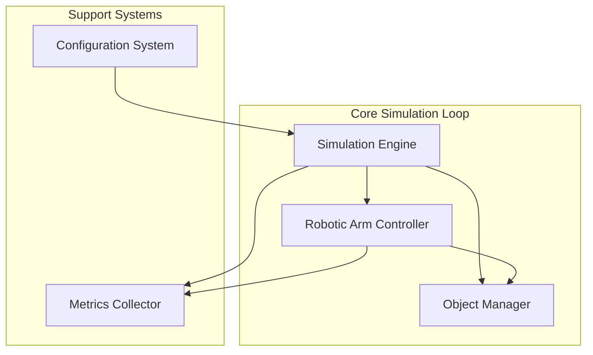
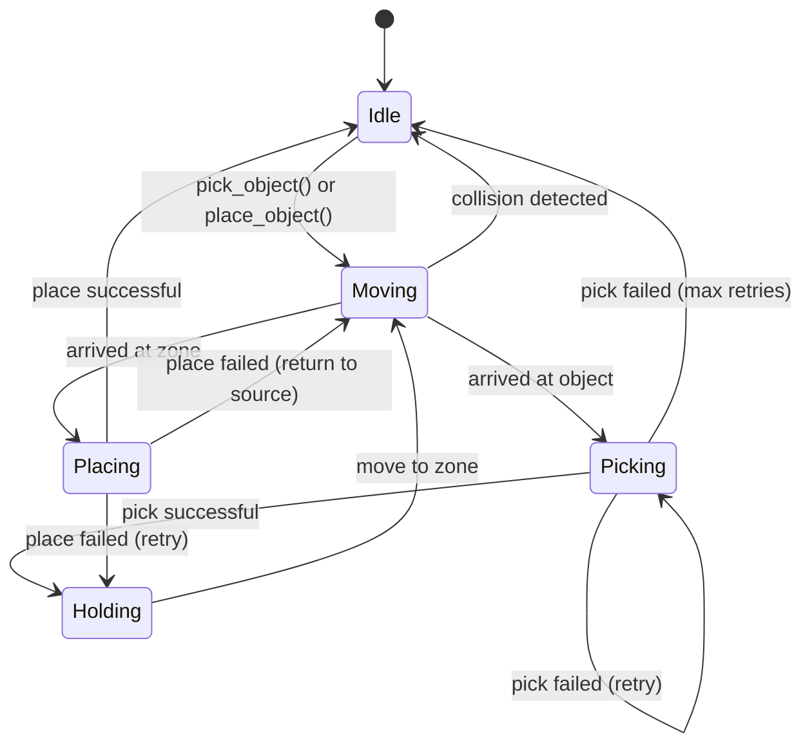

# Design Document: Robotic Pick-and-Place Sorting System

## Overview

The robotic sorting system simulation is designed as a discrete event simulation that models a robotic arm performing pick-and-place operations. The system prioritizes practical task execution, testability, and clear performance metrics over physical accuracy.

The architecture separates concerns into distinct layers:
- **Simulation Engine**: Manages state, time progression, and event processing
- **Robotic Arm Controller**: Handles arm movement, pick/place operations, and path planning
- **Object Management**: Tracks objects, their properties, and locations
- **Metrics Collection**: Records performance data and generates reports
- **Configuration System**: Manages scenarios and simulation parameters

The design emphasizes deterministic behavior (with configurable randomness), comprehensive failure handling, and extensive testability through property-based testing.

## Architecture



### Key Design Decisions

1. **Discrete Event Simulation**: Rather than continuous physics, we use discrete states and transitions. This simplifies testing and ensures deterministic behavior.

2. **Deterministic Randomness**: All random events (failures, collisions) use a seeded random number generator, allowing reproducible test scenarios.

3. **State Machine for Arm**: The robotic arm operates as a state machine (Idle → Moving → Picking → Holding → Placing → Idle), making behavior predictable and testable.

4. **Spatial Simplification**: Objects and zones are represented as 2D regions with simple boundary checking rather than complex 3D physics.

5. **Retry Logic**: Failed operations trigger automatic retries with exponential backoff, up to configured limits.

## Components and Interfaces

### Simulation Engine

The core orchestrator that manages simulation state and coordinates all components.

```
class SimulationEngine:
    state: SimulationState
    arm_controller: RoboticArmController
    object_manager: ObjectManager
    metrics_collector: MetricsCollector
    config: SimulationConfig
    random_generator: RandomGenerator
    
    initialize(config: SimulationConfig) -> Result
    run_cycle() -> SimulationResult
    step() -> StepResult
    get_metrics() -> MetricsReport
    reset() -> Result
```

**Responsibilities:**
- Initialize simulation with configuration
- Execute simulation cycles step-by-step
- Coordinate between arm controller and object manager
- Trigger metrics collection
- Handle simulation-level errors

### Robotic Arm Controller

Manages the robotic arm's state, movement, and operations.

```
class RoboticArmController:
    state: ArmState  # Idle, Moving, Picking, Holding, Placing
    position: Position2D
    held_object: Optional[Object]
    target_position: Optional[Position2D]
    retry_count: int
    
    pick_object(object_id: ObjectID) -> OperationResult
    place_object(zone: TargetZone) -> OperationResult
    move_to(position: Position2D) -> MovementResult
    check_collision(path: Path) -> CollisionResult
    get_state() -> ArmState
    reset() -> Result
```

**Responsibilities:**
- Execute pick and place operations
- Manage arm state transitions
- Detect collisions along movement paths
- Implement retry logic for failed operations
- Report operation outcomes

**State Transitions:**


### Object Manager

Tracks all objects in the simulation and their locations.

```
class ObjectManager:
    objects: Map[ObjectID, Object]
    source_area: SourceArea
    target_zones: List[TargetZone]
    
    create_objects(specs: List[ObjectSpec]) -> List[ObjectID]
    get_object(object_id: ObjectID) -> Optional[Object]
    get_available_objects() -> List[Object]
    remove_from_source(object_id: ObjectID) -> Result
    place_in_zone(object_id: ObjectID, zone: TargetZone) -> Result
    return_to_source(object_id: ObjectID) -> Result
    get_target_zone(object: Object, criteria: SortingCriteria) -> TargetZone
    is_zone_full(zone: TargetZone) -> bool
```

**Responsibilities:**
- Create and track objects with properties
- Manage source area and target zones
- Determine correct target zone based on sorting criteria
- Validate zone capacity
- Track object locations

### Metrics Collector

Records performance data throughout the simulation.

```
class MetricsCollector:
    successful_picks: int
    failed_picks: int
    successful_places: int
    failed_places: int
    collisions: int
    missed_picks: int
    correct_placements: int
    incorrect_placements: int
    start_time: Timestamp
    end_time: Optional[Timestamp]
    operation_history: List[OperationRecord]
    
    record_pick(success: bool, missed: bool) -> None
    record_place(success: bool, correct_zone: bool) -> None
    record_collision() -> None
    record_operation(operation: OperationRecord) -> None
    calculate_metrics() -> MetricsReport
    reset() -> None
```

**Responsibilities:**
- Record all operation outcomes
- Track timing information
- Calculate success rates and accuracy
- Generate comprehensive reports
- Maintain operation history

### Configuration System

Manages simulation parameters and scenario definitions.

```
class SimulationConfig:
    object_count: int
    object_specs: List[ObjectSpec]
    sorting_criteria: SortingCriteria
    target_zones: List[TargetZoneConfig]
    failure_rates: FailureRates
    max_cycle_time: Duration
    random_seed: Optional[int]
    retry_limits: RetryConfig
    
    validate() -> ValidationResult
    save(path: FilePath) -> Result
    load(path: FilePath) -> Result[SimulationConfig]
```

**Responsibilities:**
- Store all configuration parameters
- Validate configuration consistency
- Support serialization for repeatable scenarios
- Provide default configurations

## Data Models

### Object

```
class Object:
    id: ObjectID
    color: Color  # Red, Blue, Green, Yellow, etc.
    size: Size    # Small, Medium, Large
    type: ObjectType  # TypeA, TypeB, TypeC, etc.
    position: Position2D
    state: ObjectState  # InSource, Held, InZone
```

### Position and Spatial Types

```
class Position2D:
    x: float
    y: float

class BoundingBox:
    min: Position2D
    max: Position2D
    
    contains(point: Position2D) -> bool
    intersects(other: BoundingBox) -> bool

class SourceArea:
    bounds: BoundingBox
    capacity: int

class TargetZone:
    id: ZoneID
    bounds: BoundingBox
    capacity: int
    criteria_value: PropertyValue  # e.g., "Red", "Large", "TypeA"
    current_count: int
```

### Operation Results

```
class OperationResult:
    success: bool
    operation_type: OperationType  # Pick, Place
    object_id: Optional[ObjectID]
    error: Optional[ErrorType]
    retry_count: int
    timestamp: Timestamp

enum ErrorType:
    MissedPick
    Collision
    ZoneFull
    ObjectNotFound
    InvalidState
    MaxRetriesExceeded
```

### Metrics Report

```
class MetricsReport:
    total_objects: int
    successful_operations: int
    failed_operations: int
    success_rate: float  # percentage
    accuracy: float  # percentage of correct placements
    total_time: Duration
    collisions: int
    missed_picks: int
    operations_per_second: float
    cycle_complete: bool
```

### Configuration Types

```
class ObjectSpec:
    color: Color
    size: Size
    type: ObjectType
    initial_position: Optional[Position2D]

class FailureRates:
    missed_pick_probability: float  # 0.0 to 1.0
    collision_probability: float    # 0.0 to 1.0

class RetryConfig:
    max_pick_retries: int
    max_place_retries: int
    retry_delay: Duration

enum SortingCriteria:
    ByColor
    BySize
    ByType
```

## Correctness Properties

*A property is a characteristic or behavior that should hold true across all valid executions of a system—essentially, a formal statement about what the system should do. Properties serve as the bridge between human-readable specifications and machine-verifiable correctness guarantees.*


### Property 1: Successful Pick Removes Object from Source

*For any* available object in the Source_Area, when a Pick_Operation is initiated and succeeds, the object should be removed from the Source_Area and held by the Robotic_Arm.

**Validates: Requirements 1.1**

### Property 2: Single Object Picking

*For any* Source_Area containing multiple objects, when the Robotic_Arm performs pick operations, it should hold at most one object at any given time.

**Validates: Requirements 1.2**

### Property 3: Pick Retry Logic

*For any* Pick_Operation that results in a Missed_Pick, the system should retry up to 3 times before marking the operation as failed.

**Validates: Requirements 1.5**

### Property 4: Correct Target Zone Determination

*For any* object and any Sorting_Criteria (color, size, or type), the system should determine the Target_Zone that matches the object's property corresponding to the active criteria.

**Validates: Requirements 2.1, 2.2, 2.3, 2.4**

### Property 5: Primary Criteria Priority

*For any* object with properties that could match multiple Target_Zones, the system should use only the primary Sorting_Criteria to determine placement, ignoring other properties.

**Validates: Requirements 2.5**

### Property 6: Successful Placement in Target Zone

*For any* Place_Operation that succeeds, the object should be located within the boundaries of the designated Target_Zone and no longer held by the Robotic_Arm.

**Validates: Requirements 3.1, 3.2**

### Property 7: Failed Placement Returns to Source

*For any* Place_Operation that fails (excluding zone-full errors), the object should be returned to the Source_Area and available for re-picking.

**Validates: Requirements 3.5**

### Property 8: Collision Detection

*For any* Robotic_Arm movement path that intersects with another object's bounding box, the system should detect and report a Collision.

**Validates: Requirements 4.1**

### Property 9: Collision Response

*For any* detected Collision during movement, the Robotic_Arm should stop immediately, attempt an alternative path, and record the collision event.

**Validates: Requirements 4.2, 4.3, 4.5**

### Property 10: Simulation Initialization

*For any* valid SimulationConfig, when a Simulation_Cycle is started, the Source_Area should contain exactly the configured number of objects with the specified property distributions.

**Validates: Requirements 5.1, 5.5**

### Property 11: Simulation Completion

*For any* Simulation_Cycle, the cycle should complete when either all objects are processed or the maximum cycle time is reached, whichever occurs first.

**Validates: Requirements 5.2, 5.3**

### Property 12: Comprehensive Metrics Reporting

*For any* completed Simulation_Cycle, the generated MetricsReport should include Success_Rate, total time, counts of all operation types (successful/failed picks/places, collisions, missed picks), and accuracy percentage.

**Validates: Requirements 5.4, 6.1, 6.2, 6.3, 6.4**

### Property 13: Metrics History Persistence

*For any* sequence of Simulation_Cycles, the system should maintain a history of all MetricsReports that can be retrieved for comparison.

**Validates: Requirements 6.5**

### Property 14: Deterministic Execution

*For any* SimulationConfig with a specified random seed, running the simulation multiple times should produce identical results (same operation sequence, same metrics, same outcomes).

**Validates: Requirements 7.1**

### Property 15: Statistical Consistency

*For any* SimulationConfig run multiple times with different random seeds, the Success_Rate should vary by no more than 5 percent across runs.

**Validates: Requirements 7.2**

### Property 16: Graceful Failure Handling

*For any* failure condition (Missed_Pick, Collision, zone full, invalid state), the system should handle it without crashing, record the failure, and continue or terminate gracefully.

**Validates: Requirements 7.3, 7.5**

### Property 17: Normal Operation Success Rate

*For any* Simulation_Cycle run under normal conditions (low failure rates, adequate zone capacity), the system should achieve at least 95 percent successful operations.

**Validates: Requirements 7.4**

### Property 18: Configuration Acceptance

*For any* valid configuration parameters (object count, property distributions, target zones, failure rates), the system should accept the configuration and apply it to the simulation.

**Validates: Requirements 8.1, 8.2, 8.3, 8.4**

### Property 19: Configuration Round-Trip

*For any* valid SimulationConfig, saving it to a file and then loading it back should produce an equivalent configuration that yields the same simulation behavior.

**Validates: Requirements 8.5**

### Property 20: Operation Metrics Recording

*For any* operation (pick or place), when it completes (successfully or with failure), the system should record the operation outcome in the metrics collector with correct categorization.

**Validates: Requirements 1.4, 3.4**

## Error Handling

The system implements comprehensive error handling at multiple levels:

### Operation-Level Errors

**Missed Pick**:
- Detected when pick operation fails to grasp object
- Triggers automatic retry (up to 3 attempts)
- After max retries, operation marked as failed
- Metrics updated with missed pick count
- Arm returns to idle state

**Collision**:
- Detected during path planning or movement
- Arm stops immediately
- Alternative path computed if possible
- If no alternative exists, operation fails
- Collision recorded in metrics
- Arm returns to safe state

**Zone Full**:
- Detected before place operation
- Operation marked as failed immediately
- Object returned to source area
- Error reported in operation result
- Metrics updated with failed placement

### State-Level Errors

**Invalid State Transitions**:
- Detected when operation requested in wrong state
- Operation rejected with error
- State remains unchanged
- Error logged for debugging

**Object Not Found**:
- Detected when referencing non-existent object
- Operation fails immediately
- Error reported with object ID
- System continues with other objects

### System-Level Errors

**Configuration Validation**:
- Invalid parameters rejected at configuration time
- Clear error messages indicate specific issues
- System refuses to start with invalid config
- Validation includes: negative counts, invalid probabilities, zone conflicts

**Unrecoverable Errors**:
- Memory allocation failures
- File I/O errors during config save/load
- System logs detailed error information
- Graceful shutdown with partial results if available
- Error code returned to caller

### Error Recovery Strategy

1. **Retry with Backoff**: Transient failures (missed picks) trigger automatic retries
2. **Alternative Paths**: Collisions trigger path replanning
3. **Graceful Degradation**: Failed operations don't stop entire simulation
4. **State Cleanup**: All errors ensure system returns to consistent state
5. **Comprehensive Logging**: All errors recorded for post-analysis

## Testing Strategy

The testing strategy employs a dual approach combining property-based testing for universal correctness properties and unit testing for specific examples and edge cases.

### Property-Based Testing

Property-based testing will be implemented using a PBT library appropriate for the target language (e.g., Hypothesis for Python, fast-check for TypeScript, QuickCheck for Haskell). Each correctness property defined above will be implemented as a property-based test.

**Configuration**:
- Minimum 100 iterations per property test
- Each test tagged with: **Feature: robotic-sorting-system, Property N: [property text]**
- Generators for: Objects (random colors/sizes/types), Positions, Configurations, Operation sequences

**Key Generators**:
- `arbitrary_object()`: Generates objects with random valid properties
- `arbitrary_position()`: Generates valid 2D positions within bounds
- `arbitrary_config()`: Generates valid simulation configurations
- `arbitrary_operation_sequence()`: Generates sequences of pick/place operations
- `arbitrary_failure_scenario()`: Generates scenarios with controlled failure rates

**Example Property Test Structure**:
```
@property_test(iterations=100)
# Feature: robotic-sorting-system, Property 1: Successful Pick Removes Object from Source
def test_successful_pick_removes_from_source(object, config):
    sim = SimulationEngine(config)
    sim.initialize()
    initial_count = sim.object_manager.get_available_objects().count()
    
    result = sim.arm_controller.pick_object(object.id)
    
    if result.success:
        assert sim.object_manager.get_available_objects().count() == initial_count - 1
        assert sim.arm_controller.held_object == object
```

### Unit Testing

Unit tests complement property tests by focusing on:

**Specific Examples**:
- Pick operation with a red cube
- Place operation in color-sorted zone
- Collision between arm and specific object position
- Configuration with 10 objects, 3 zones

**Edge Cases**:
- Empty source area (no objects to pick)
- Full target zone (cannot place)
- No alternative path available (unrecoverable collision)
- Maximum retry limit reached
- Zero failure probability (perfect execution)
- 100% failure probability (all operations fail)

**Integration Points**:
- Simulation engine coordinating arm and object manager
- Metrics collector receiving events from multiple sources
- Configuration loading and validation
- Complete simulation cycle from start to finish

**Error Conditions**:
- Invalid configuration parameters
- Operations in wrong state
- Non-existent object references
- File I/O errors during config save/load

### Test Organization

```
tests/
├── property_tests/
│   ├── test_picking_properties.py
│   ├── test_sorting_properties.py
│   ├── test_placement_properties.py
│   ├── test_collision_properties.py
│   ├── test_simulation_properties.py
│   ├── test_metrics_properties.py
│   ├── test_reliability_properties.py
│   └── test_configuration_properties.py
├── unit_tests/
│   ├── test_simulation_engine.py
│   ├── test_arm_controller.py
│   ├── test_object_manager.py
│   ├── test_metrics_collector.py
│   └── test_configuration.py
└── integration_tests/
    ├── test_complete_cycles.py
    └── test_failure_scenarios.py
```

### Testing Balance

- Property tests handle comprehensive input coverage through randomization
- Unit tests focus on specific examples that demonstrate correct behavior
- Integration tests verify component interactions
- Edge case tests ensure boundary conditions are handled
- Together, these provide confidence in both general correctness and specific scenarios

### Test Execution

- All tests should be runnable with a single command
- Property tests configured for minimum 100 iterations
- Fast feedback loop (tests complete in under 1 minute for development)
- CI/CD integration for automated testing on commits
- Coverage reporting to identify untested code paths
